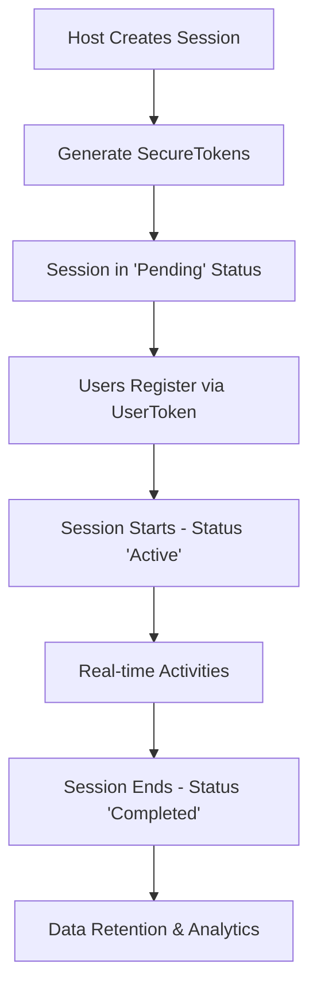
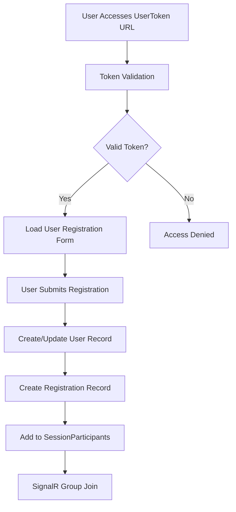

# Canvas Schema Data Flows and Integration

## Data Flow Architecture

The canvas schema operates within a **dual-schema architecture** where application data flows through the `canvas` schema while integrating with Islamic content from the `dbo` schema.

### Core Data Flow Patterns

#### 🎯 Session Lifecycle Flow


#### 👥 User Registration Flow


## Cross-Schema Integration

### Session Content Linking
The integration between canvas sessions and Islamic content follows a **bridge pattern**:

```sql
-- Primary relationship
canvas.Sessions.SessionId = canvas.SecureTokens.SessionId

-- Cross-schema bridge  
canvas.Sessions.SessionId = dbo.Sessions.SessionID
canvas.Sessions.KSessionsId = dbo.Sessions.SessionID  -- Optional explicit link
```

### Content Access Pattern
```sql
-- Typical content access query
SELECT 
    cs.Title as SessionTitle,
    cs.Status,
    ds.SessionName as IslamicContentTitle,
    st.Transcript as ContentText,
    cs.ParticipantCount
FROM canvas.Sessions cs
INNER JOIN dbo.Sessions ds ON cs.SessionId = ds.SessionID
LEFT JOIN dbo.SessionTranscripts st ON ds.SessionID = st.SessionID  
WHERE cs.Status = 'Active'
```

## Real-time Data Flows

### SignalR Hub Integration

#### SessionHub Data Flow
```csharp
// Participant join flow
1. User validates token → canvas.SecureTokens
2. Create participant record → canvas.SessionParticipants  
3. Join SignalR group → Group name: "Session_{sessionId}"
4. Broadcast update → All group members
5. Update participant count → canvas.Sessions.ParticipantCount
```

#### AnnotationHub Data Flow  
```csharp
// Real-time annotation flow
1. User creates annotation → canvas.Annotations
2. Broadcast to session group → SignalR
3. Update annotation data → JSON in AnnotationData field
4. Audit log entry → canvas.AuditLog
```

#### QAHub Data Flow
```csharp  
// Question & Answer flow
1. Submit question → canvas.Questions (Status: 'Pending')
2. Community voting → canvas.QuestionVotes
3. Update vote count → canvas.Questions.VoteCount  
4. Host answers → canvas.QuestionAnswers
5. Mark answered → canvas.Questions.AnsweredAt
6. Broadcast updates → SignalR to all participants
```

## Data Persistence Patterns

### Entity Framework Integration
The canvas schema integrates with Entity Framework Core through:

#### DbContext Configuration
```csharp
public class CanvasDbContext : DbContext
{
    // Canvas schema entities
    public DbSet<Session> Sessions { get; set; }
    public DbSet<User> Users { get; set; }
    public DbSet<SecureToken> SecureTokens { get; set; }
    public DbSet<Question> Questions { get; set; }
    public DbSet<Annotation> Annotations { get; set; }
    public DbSet<SharedAsset> SharedAssets { get; set; }
    
    protected override void OnModelCreating(ModelBuilder modelBuilder)
    {
        // Canvas schema specification
        modelBuilder.HasDefaultSchema("canvas");
        
        // Cross-schema relationships
        modelBuilder.Entity<Session>()
            .HasOne<DboSession>()
            .WithOne()
            .HasForeignKey<Session>(s => s.SessionId);
    }
}
```

### Migration Strategy
```csharp
// Entity Framework migrations respect schema boundaries
public partial class InitialCanvasSchema : Migration
{
    protected override void Up(MigrationBuilder migrationBuilder)
    {
        migrationBuilder.EnsureSchema("canvas");
        
        // Create canvas tables with dbo references
        migrationBuilder.CreateTable(
            name: "Sessions",
            schema: "canvas",
            columns: table => new
            {
                SessionId = table.Column<long>(nullable: false),
                // ... other columns
            });
            
        // Foreign key to dbo schema
        migrationBuilder.AddForeignKey(
            name: "FK_Sessions_dbo_Sessions",
            schema: "canvas",
            table: "Sessions", 
            column: "SessionId",
            principalSchema: "dbo",
            principalTable: "Sessions",
            principalColumn: "SessionID");
    }
}
```

## Data Flow Security

### Token-Based Access Control
```sql
-- Token validation flow
DECLARE @Token NVARCHAR(8) = 'USER123A'
DECLARE @SessionId BIGINT

-- Validate and extract session
SELECT @SessionId = SessionId 
FROM canvas.SecureTokens
WHERE (HostToken = @Token OR UserToken = @Token)
AND IsActive = 1 
AND ExpiresAt > GETUTCDATE()

-- Update access tracking
UPDATE canvas.SecureTokens 
SET AccessCount = AccessCount + 1,
    LastAccessedAt = GETUTCDATE()
WHERE (HostToken = @Token OR UserToken = @Token)
```

### Audit Trail Flow
```sql
-- Comprehensive audit logging
INSERT INTO canvas.AuditLog (At, Actor, SessionId, UserId, Action, Details)
VALUES (
    GETUTCDATE(),
    'User:' + @UserGuid,
    @SessionId, 
    @UserId,
    'QUESTION_SUBMITTED',
    JSON_OBJECT(
        'questionText', @QuestionText,
        'ipAddress', @UserIP,
        'userAgent', @UserAgent
    )
)
```

## Asset Management Flow

### SharedAssets Selector System
The revolutionary **selector-based asset detection** system:

```javascript
// Frontend: Asset detection via selectors
const assetContainers = [
    '.noor-share-container[data-share-id="1"]',
    '.noor-share-container[data-share-id="2"]',  
    // ... 14 total selectors
];

// Detect shareable content
assetContainers.forEach((selector, index) => {
    const element = document.querySelector(selector);
    if (element && element.hasContent()) {
        registerSharedAsset(sessionId, selector, index, element.getMetadata());
    }
});
```

```sql
-- Backend: Store asset references (not content)
INSERT INTO canvas.SharedAssets (
    SessionId, 
    SharedAt, 
    AssetType, 
    AssetSelector,        -- CSS selector instead of HTML blob
    AssetPosition, 
    AssetMetadata         -- JSON metadata
) VALUES (
    @SessionId,
    GETUTCDATE(),
    'SHARE',
    '.noor-share-container[data-share-id="3"]',  -- 90% storage reduction
    3,
    JSON_OBJECT('title', @Title, 'description', @Description)
)
```

## Performance Data Flows

### Participant Count Updates
```sql
-- Real-time participant counting
WITH ActiveParticipants AS (
    SELECT SessionId, COUNT(*) as ActiveCount
    FROM canvas.SessionParticipants  
    WHERE LeftAt IS NULL
    GROUP BY SessionId
)
UPDATE s SET ParticipantCount = ap.ActiveCount
FROM canvas.Sessions s
INNER JOIN ActiveParticipants ap ON s.SessionId = ap.SessionId
```

### Question Priority Calculation
```sql
-- Dynamic question prioritization 
UPDATE q SET VoteCount = v.TotalVotes
FROM canvas.Questions q
INNER JOIN (
    SELECT QuestionId, SUM(VoteValue) as TotalVotes
    FROM canvas.QuestionVotes
    GROUP BY QuestionId  
) v ON q.QuestionId = v.QuestionId
```

## Backup and Recovery Flows

### Schema-Isolated Backups
```sql
-- Canvas schema backup (application data only)
BACKUP DATABASE KSESSIONS_DEV 
TO DISK = 'C:\Backups\CanvasSchema_20250920.bak'
WITH 
    PARTIAL,
    FILEGROUP = 'PRIMARY',
    NAME = 'Canvas Schema Application Data Backup'
```

### Selective Restore Scenarios
```sql
-- Restore strategy preserves Islamic content
-- 1. Restore dbo schema (Islamic content) 
-- 2. Apply canvas schema migrations
-- 3. Restore canvas application data
-- 4. Validate cross-schema relationships
```

## Integration Testing Flows

### Database State Management
```sql
-- Test setup: Clean canvas, preserve dbo
EXEC canvas.StartFresh 
    @ConfirmationToken = 'NOOR_CANVAS_START_FRESH',
    @DryRun = 0

-- Verify isolation
SELECT 
    (SELECT COUNT(*) FROM canvas.Sessions) as CanvasSessions,
    (SELECT COUNT(*) FROM dbo.Sessions) as IslamicSessions,
    (SELECT COUNT(*) FROM dbo.Categories) as IslamicCategories
-- Expected: 0, >0, >0
```

### End-to-End Test Flow
```csharp
[Test]
public async Task SessionLifecycle_EndToEnd()
{
    // 1. Create session → canvas.Sessions
    var sessionId = await CreateTestSession();
    
    // 2. Generate tokens → canvas.SecureTokens  
    var tokens = await GenerateSessionTokens(sessionId);
    
    // 3. User registration → canvas.Users, canvas.Registrations
    var userId = await RegisterTestUser(tokens.UserToken);
    
    // 4. Submit questions → canvas.Questions
    await SubmitTestQuestions(sessionId, userId);
    
    // 5. Create annotations → canvas.Annotations
    await CreateTestAnnotations(sessionId);
    
    // 6. Share assets → canvas.SharedAssets
    await ShareTestAssets(sessionId);
    
    // 7. Verify data integrity
    await VerifySessionState(sessionId);
    
    // 8. Cleanup → canvas.StartFresh
    await CleanupTestData();
}
```

---

## Data Flow Monitoring

### Real-time Metrics
```sql
-- Session activity dashboard
SELECT 
    s.SessionId,
    s.Title,
    s.Status,
    s.ParticipantCount,
    COUNT(q.QuestionId) as QuestionCount,
    COUNT(a.AnnotationId) as AnnotationCount,
    COUNT(sa.AssetId) as SharedAssetCount,
    MAX(sp.JoinedAt) as LastJoinTime
FROM canvas.Sessions s
LEFT JOIN canvas.Questions q ON s.SessionId = q.SessionId
LEFT JOIN canvas.Annotations a ON s.SessionId = a.SessionId  
LEFT JOIN canvas.SharedAssets sa ON s.SessionId = sa.SessionId
LEFT JOIN canvas.SessionParticipants sp ON s.SessionId = sp.SessionId
WHERE s.Status = 'Active'
GROUP BY s.SessionId, s.Title, s.Status, s.ParticipantCount
```

### Performance Tracking
```sql
-- Query performance monitoring
SELECT 
    qt.query_text_id,
    qt.query_sql_text,
    rs.count_executions,
    rs.avg_duration,
    rs.avg_cpu_time,
    rs.avg_logical_io_reads
FROM sys.query_store_query_text qt
INNER JOIN sys.query_store_query q ON qt.query_text_id = q.query_text_id
INNER JOIN sys.query_store_runtime_stats rs ON q.query_id = rs.query_id
WHERE qt.query_sql_text LIKE '%canvas%'
ORDER BY rs.avg_duration DESC
```

---

**Integration Summary**: The canvas schema's data flows are optimized for real-time Islamic learning experiences while maintaining clear separation from historical Islamic content. The **selector-based asset system** and **SignalR integration** enable sub-3-second participant updates and efficient content sharing at scale.