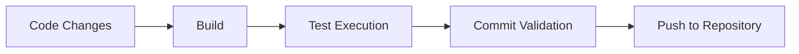

# Development Workflow Technical Reference

Technical implementation details for NOOR Canvas development workflows.

## Workflow Architecture

### 1. Code Development Cycle



### 2. Automated Testing Integration

#### Smart Caching System

- **Source Code Hashing**: SHA256 of .cs/.cshtml/.razor files
- **Build Artifact Hashing**: SHA256 of compiled binaries
- **Cache Invalidation**: Automatic cache clearing on source changes

#### Test Execution Triggers

- **Post-Build**: Automatic execution after successful builds
- **Pre-Commit**: Git hook validation before commits
- **Manual**: Developer-initiated test runs

### 3. Development Server Management

#### Process Lifecycle

```csharp
// IIS Express x64 launch pattern
var processInfo = new ProcessStartInfo
{
    FileName = "iisexpress.exe",
    Arguments = "/config:applicationhost.config /site:NoorCanvas",
    UseShellExecute = false
};
```

#### Port Management

- **9090**: HTTP development server
- **9091**: HTTPS development server (primary)
- **Conflict Resolution**: Automatic port scanning and assignment

## Integration Points

### Git Integration

- **Pre-commit hooks**: `.git/hooks/pre-commit`
- **Smart testing**: Only run tests if source code changed
- **Commit blocking**: Prevent commits with failing tests

### Visual Studio Code Integration

- **Task definitions**: `.vscode/tasks.json`
- **Launch configurations**: `.vscode/launch.json`
- **Extension requirements**: C# DevKit, PowerShell

### PowerShell Integration

- **Global commands**: `nc`, `nct`, `ncdoc`, `iiskill`
- **Profile integration**: Automatic command loading
- **Cross-session persistence**: Command availability across terminals

## Performance Characteristics

### Build Performance

- **Clean build**: ~3-5 seconds
- **Incremental build**: ~1-2 seconds
- **Test execution**: ~5-10 seconds
- **Full cycle**: ~10-20 seconds

### Caching Benefits

- **Cache hit**: ~0.1 seconds (instant)
- **Cache miss**: Full test execution
- **Cache invalidation**: Automatic on source changes

## Configuration Management

### Environment Variables

```powershell
$env:NOOR_CANVAS_ENV = "Development"
$env:NOOR_CANVAS_PORT = "9091"
$env:NOOR_CANVAS_SSL = "true"
```

### Configuration Files

- `appsettings.json`: Application configuration
- `appsettings.Development.json`: Development overrides
- `launchSettings.json`: Development server settings

## Error Handling and Recovery

### Common Issues

1. **File Locking**: Process termination and retry logic
2. **Port Conflicts**: Automatic port scanning and assignment
3. **Certificate Issues**: Automatic HTTPS certificate handling
4. **Database Connectivity**: Connection string validation and fallback

### Recovery Strategies

- **Process cleanup**: `iiskill` command for stuck processes
- **Cache clearing**: Manual cache invalidation options
- **Force rebuild**: Clean build options
- **Dependency refresh**: Package restoration

_This technical reference is maintained automatically as workflow improvements are implemented._
