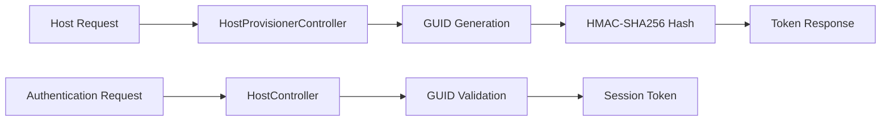
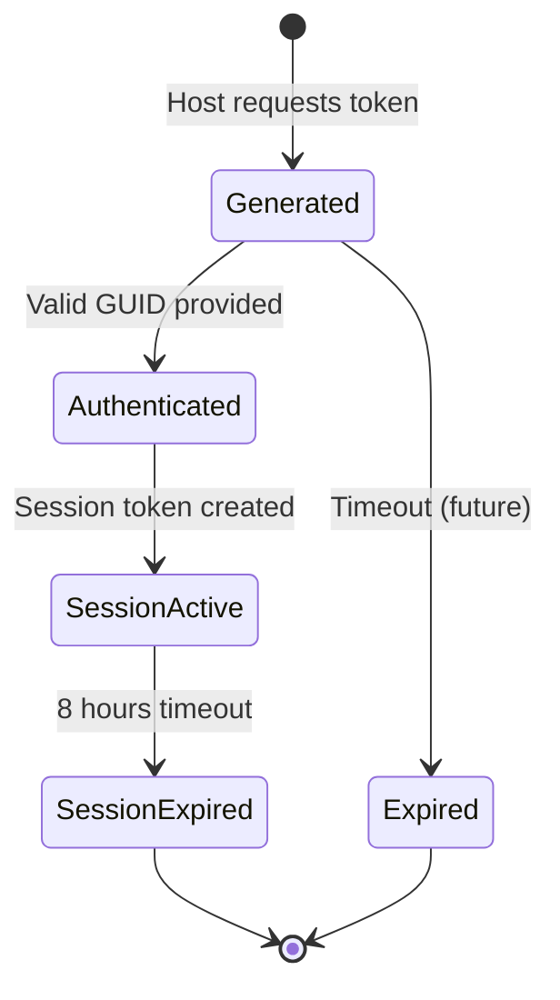

# NOOR Canvas Host Token Generation and Validation System

## Overview

The NOOR Canvas Host Token System provides secure authentication for session hosts using GUID-based tokens with HMAC-SHA256 validation. The system consists of two main components: **Token Generation** and **Token Authentication**, designed for both development flexibility and production security.

## Table of Contents

1. [System Architecture](#system-architecture)
2. [Token Generation Process](#token-generation-process)
3. [Token Validation Process](#token-validation-process)
4. [Security Model](#security-model)
5. [API Reference](#api-reference)
6. [Implementation Phases](#implementation-phases)
7. [Usage Examples](#usage-examples)
8. [Troubleshooting](#troubleshooting)

## System Architecture

### Component Overview



### Core Components

- **HostProvisionerController**: Generates new host tokens (database-independent)
- **HostController**: Validates host tokens and creates session tokens
- **HMAC-SHA256**: Cryptographic hash function for token integrity
- **Session Management**: Links host tokens to active sessions

## Token Generation Process

### Step 1: Token Request

The token generation process begins when a host requests a new authentication token.

**API Endpoint**: `POST /api/hostprovisioner/generate`

**Request Structure**:

```json
{
  "sessionId": 100,
  "createdBy": "Host Name"
}
```

### Step 2: GUID Generation

A new UUID (Version 4) is generated using .NET's `Guid.NewGuid()` method:

```csharp
var hostGuid = Guid.NewGuid();
// Example: "f47ac10b-58cc-4372-a567-0e02b2c3d479"
```

**GUID Format**:

- **Length**: 36 characters (32 hex digits + 4 hyphens)
- **Standard**: RFC 4122 compliant UUID Version 4
- **Entropy**: 122 bits of randomness
- **Collision Probability**: ~5.3 x 10^-37

### Step 3: Hash Generation

Each GUID is cryptographically signed using HMAC-SHA256:

```csharp
private static string ComputeHash(string input)
{
    using var hmac = new HMACSHA256(Encoding.UTF8.GetBytes(AppSecret));
    var hashBytes = hmac.ComputeHash(Encoding.UTF8.GetBytes(input));
    return Convert.ToBase64String(hashBytes);
}
```

**Security Properties**:

- **Algorithm**: HMAC-SHA256
- **Secret Key**: `"NOOR-CANVAS-HOST-SECRET-2025"`
- **Output**: Base64-encoded hash (44 characters)
- **Integrity**: Tampering detection capability

### Step 4: Response Generation

The system returns a comprehensive token response:

```json
{
  "hostGuid": "f47ac10b-58cc-4372-a567-0e02b2c3d479",
  "sessionId": 100,
  "createdBy": "Host Name",
  "createdAt": "2025-09-13T15:30:00Z",
  "hash": "A1B2C3D4E5F6G7H8..."
}
```

## Token Validation Process

### Phase 2 Implementation (Current)

The current validation system is designed for development and testing:

```csharp
[HttpPost("authenticate")]
public async Task<IActionResult> AuthenticateHost([FromBody] HostAuthRequest request)
{
    // 1. GUID Format Validation
    if (!Guid.TryParse(request.HostGuid, out Guid hostGuid))
    {
        return BadRequest(new { error = "Invalid GUID format" });
    }

    // 2. Session Token Generation (Phase 2: Accept any valid GUID)
    var sessionToken = Guid.NewGuid().ToString();

    // 3. Authentication Response
    return Ok(new HostAuthResponse
    {
        Success = true,
        SessionToken = sessionToken,
        ExpiresAt = DateTime.UtcNow.AddHours(8),
        HostGuid = hostGuid.ToString()
    });
}
```

### Validation Steps

1. **Format Validation**: Ensures GUID follows RFC 4122 standard
2. **Session Token Creation**: Generates new session-specific token
3. **Response Generation**: Returns authentication credentials

### Future Enhancement (Phase 3+)

Planned database integration for production validation:

```csharp
// Future implementation will include:
var storedToken = await _context.HostTokens
    .FirstOrDefaultAsync(t => t.HostGuid == hostGuid && t.IsActive);

if (storedToken == null || !ValidateHash(storedToken))
{
    return Unauthorized("Invalid or expired token");
}
```

## Security Model

### Cryptographic Security

**HMAC-SHA256 Properties**:

- **Key Size**: 256 bits
- **Hash Output**: 256 bits (32 bytes)
- **Resistance**: Preimage, second preimage, and collision resistant
- **Performance**: ~10,000 operations per second typical throughput

**Security Guarantees**:

- **Integrity**: Hash verification prevents token tampering
- **Authenticity**: HMAC proves token was generated by authorized system
- **Non-repudiation**: Cryptographic proof of token origin

### Token Lifecycle



**Lifecycle Stages**:

1. **Generated**: Token created and returned to host
2. **Authenticated**: Token used for successful authentication
3. **Session Active**: Host has valid session (8-hour lifespan)
4. **Session Expired**: Session timeout, re-authentication required

### Phase 2 vs Production Security

| Aspect          | Phase 2 (Current)  | Production (Future)          |
| --------------- | ------------------ | ---------------------------- |
| **Validation**  | Format only        | Database + Hash verification |
| **Storage**     | None               | Encrypted database storage   |
| **Expiration**  | Session-based only | Token + Session expiration   |
| **Revocation**  | Not implemented    | Administrative revocation    |
| **Audit Trail** | Basic logging      | Comprehensive audit logs     |

## API Reference

### Generate Host Token

**Endpoint**: `POST /api/hostprovisioner/generate`

**Request Headers**:

```http
Content-Type: application/json
```

**Request Body**:

```json
{
  "sessionId": integer,     // Required: Session identifier
  "createdBy": "string"     // Optional: Host identifier
}
```

**Response (200 OK)**:

```json
{
  "hostGuid": "f47ac10b-58cc-4372-a567-0e02b2c3d479",
  "sessionId": 100,
  "createdBy": "Host Name",
  "createdAt": "2025-09-13T15:30:00Z",
  "hash": "A1B2C3D4E5F6G7H8I9J0K1L2M3N4..."
}
```

**Error Responses**:

- `500 Internal Server Error`: Token generation failed

### Authenticate Host Token

**Endpoint**: `POST /api/host/authenticate`

**Request Headers**:

```http
Content-Type: application/json
```

**Request Body**:

```json
{
  "hostGuid": "f47ac10b-58cc-4372-a567-0e02b2c3d479"
}
```

**Response (200 OK)**:

```json
{
  "success": true,
  "sessionToken": "a8b9c0d1-e2f3-4567-8901-234567890123",
  "expiresAt": "2025-09-13T23:30:00Z",
  "hostGuid": "f47ac10b-58cc-4372-a567-0e02b2c3d479"
}
```

**Error Responses**:

- `400 Bad Request`: Invalid GUID format
- `401 Unauthorized`: Invalid token (future implementation)
- `500 Internal Server Error`: Authentication system error

## Implementation Phases

### Phase 1: Foundation ✅

- Basic GUID generation
- HMAC-SHA256 implementation
- API endpoint structure

### Phase 2: Development System ✅ (Current)

- Format validation only
- Session token generation
- Basic authentication flow
- Development-friendly (accepts any valid GUID)

### Phase 3: Database Integration (Planned)

- Token storage in database
- Hash validation
- Token expiration handling
- Revocation capabilities

### Phase 4: Production Security (Planned)

- Advanced validation
- Audit logging
- Performance optimization
- Security monitoring

## Usage Examples

### Generating a Host Token

**Using PowerShell**:

```powershell
$request = @{
    sessionId = 100
    createdBy = "Conference Host"
} | ConvertTo-Json

$response = Invoke-RestMethod -Uri "https://localhost:9091/api/hostprovisioner/generate" `
    -Method Post -Body $request -ContentType "application/json" `
    -SkipCertificateCheck

Write-Host "Host GUID: $($response.hostGuid)"
```

**Using cURL**:

```bash
curl -X POST https://localhost:9091/api/hostprovisioner/generate \
  -H "Content-Type: application/json" \
  -d '{"sessionId": 100, "createdBy": "Conference Host"}' \
  -k
```

### Authenticating with Host Token

**Using PowerShell**:

```powershell
$authRequest = @{
    hostGuid = "f47ac10b-58cc-4372-a567-0e02b2c3d479"
} | ConvertTo-Json

$authResponse = Invoke-RestMethod -Uri "https://localhost:9091/api/host/authenticate" `
    -Method Post -Body $authRequest -ContentType "application/json" `
    -SkipCertificateCheck

Write-Host "Session Token: $($authResponse.sessionToken)"
Write-Host "Expires At: $($authResponse.expiresAt)"
```

### Browser Integration

**JavaScript Example**:

```javascript
// Generate host token
async function generateHostToken() {
  const response = await fetch("/api/hostprovisioner/generate", {
    method: "POST",
    headers: { "Content-Type": "application/json" },
    body: JSON.stringify({
      sessionId: 100,
      createdBy: "Web Host",
    }),
  });

  const data = await response.json();
  return data.hostGuid;
}

// Authenticate host token
async function authenticateHost(hostGuid) {
  const response = await fetch("/api/host/authenticate", {
    method: "POST",
    headers: { "Content-Type": "application/json" },
    body: JSON.stringify({ hostGuid }),
  });

  const authData = await response.json();
  if (authData.success) {
    localStorage.setItem("sessionToken", authData.sessionToken);
    window.location.href = "/host/session-opener"; // Phase 4 update: Dashboard removed
  }
}
```

## Troubleshooting

### Common Issues

#### 1. Invalid GUID Format Error

**Problem**: `400 Bad Request: Invalid GUID format`

**Causes**:

- Malformed GUID string
- Missing hyphens in GUID
- Non-hexadecimal characters

**Solution**:

```csharp
// Correct GUID format
"f47ac10b-58cc-4372-a567-0e02b2c3d479"

// Invalid formats
"f47ac10b58cc43720e02b2c3d479"      // Missing hyphens
"g47ac10b-58cc-4372-a567-0e02b2c3d479" // Invalid character 'g'
```

#### 2. JSON Serialization Issues

**Problem**: Authentication fails with valid GUID

**Root Cause**: Property name case mismatch between client and server

**Solution**: Configure camelCase JSON serialization:

```csharp
builder.Services.AddControllers()
    .AddJsonOptions(options =>
    {
        options.JsonSerializerOptions.PropertyNamingPolicy =
            System.Text.Json.JsonNamingPolicy.CamelCase;
    });
```

#### 3. CORS Issues

**Problem**: Browser requests blocked by CORS policy

**Solution**: Verify CORS configuration includes all required origins:

```csharp
builder.Services.AddCors(options =>
{
    options.AddDefaultPolicy(builder =>
    {
        builder.WithOrigins("https://localhost:9091", "http://localhost:9090")
               .AllowAnyHeader()
               .AllowAnyMethod();
    });
});
```

### Debugging Tools

#### Logging Analysis

Monitor these log patterns for troubleshooting:

```log
[INFO] NOOR-HOSTPROV: Generating host token for session 100
[INFO] NOOR-HOSTPROV: Host token generated successfully for session 100
[INFO] NOOR-INFO: Host authentication attempt for GUID: f47ac10b...
[SUCCESS] NOOR-SUCCESS: Host GUID format validated
[ERROR] NOOR-ERROR: Host authentication failed
```

#### Testing Endpoints

**Status Check**:

```bash
curl -X GET https://localhost:9091/api/hostprovisioner/status -k
```

**Expected Response**:

```json
{
  "status": "operational",
  "service": "HostProvisioner API",
  "timestamp": "2025-09-13T15:30:00Z"
}
```

## Developer Quick Reference

### Ready-to-Use Test Tokens

For development and testing, use these pre-validated GUIDs:

```
f47ac10b-58cc-4372-a567-0e02b2c3d479
3cbd173a-a146-4049-9f50-e33eb9ee2f2c
fa4a5e78-6ebd-4fad-bd9f-95e214e0c3cf
```

### Quick Commands

#### Generate Token (cURL)

```bash
curl -X POST https://localhost:9091/api/hostprovisioner/generate \
  -H "Content-Type: application/json" \
  -d '{"sessionId": 100, "createdBy": "Your Name"}' \
  -k
```

#### Authenticate Token (cURL)

```bash
curl -X POST https://localhost:9091/api/host/authenticate \
  -H "Content-Type: application/json" \
  -d '{"hostGuid": "f47ac10b-58cc-4372-a567-0e02b2c3d479"}' \
  -k
```

#### PowerShell Quick Commands

**Generate New Token**:

```powershell
$request = @{ sessionId = 100; createdBy = "Test User" } | ConvertTo-Json
$response = Invoke-RestMethod -Uri "https://localhost:9091/api/hostprovisioner/generate" -Method Post -Body $request -ContentType "application/json" -SkipCertificateCheck
Write-Host "New Host GUID: $($response.hostGuid)"
```

**Test Authentication**:

```powershell
$auth = @{ hostGuid = "f47ac10b-58cc-4372-a567-0e02b2c3d479" } | ConvertTo-Json
$result = Invoke-RestMethod -Uri "https://localhost:9091/api/host/authenticate" -Method Post -Body $auth -ContentType "application/json" -SkipCertificateCheck
Write-Host "Success: $($result.success)"
Write-Host "Session Token: $($result.sessionToken)"
```

#### Direct Session Flow Access

Navigate to: `https://localhost:9091/host/session-opener` (Dashboard removed - Phase 4 update)

### Integration Examples

#### JavaScript Client Integration

```javascript
class HostTokenManager {
  constructor(baseUrl = "https://localhost:9091") {
    this.baseUrl = baseUrl;
  }

  async generateToken(sessionId, createdBy) {
    try {
      const response = await fetch(
        `${this.baseUrl}/api/hostprovisioner/generate`,
        {
          method: "POST",
          headers: { "Content-Type": "application/json" },
          body: JSON.stringify({ sessionId, createdBy }),
        },
      );
      return await response.json();
    } catch (error) {
      console.error("Token generation failed:", error);
      throw error;
    }
  }

  async authenticate(hostGuid) {
    try {
      const response = await fetch(`${this.baseUrl}/api/host/authenticate`, {
        method: "POST",
        headers: { "Content-Type": "application/json" },
        body: JSON.stringify({ hostGuid }),
      });
      return await response.json();
    } catch (error) {
      console.error("Authentication failed:", error);
      throw error;
    }
  }
}

// Usage
const tokenManager = new HostTokenManager();
const token = await tokenManager.generateToken(100, "JavaScript Host");
const auth = await tokenManager.authenticate(token.hostGuid);
```

#### C# Client Integration

```csharp
public class HostTokenClient
{
    private readonly HttpClient _httpClient;
    private readonly string _baseUrl;

    public HostTokenClient(HttpClient httpClient, string baseUrl = "https://localhost:9091")
    {
        _httpClient = httpClient;
        _baseUrl = baseUrl;
    }

    public async Task<HostTokenResponse> GenerateTokenAsync(int sessionId, string createdBy)
    {
        var request = new { sessionId, createdBy };
        var json = JsonSerializer.Serialize(request);
        var content = new StringContent(json, Encoding.UTF8, "application/json");

        var response = await _httpClient.PostAsync($"{_baseUrl}/api/hostprovisioner/generate", content);
        response.EnsureSuccessStatusCode();

        var responseJson = await response.Content.ReadAsStringAsync();
        return JsonSerializer.Deserialize<HostTokenResponse>(responseJson);
    }

    public async Task<HostAuthResponse> AuthenticateAsync(string hostGuid)
    {
        var request = new { hostGuid };
        var json = JsonSerializer.Serialize(request);
        var content = new StringContent(json, Encoding.UTF8, "application/json");

        var response = await _httpClient.PostAsync($"{_baseUrl}/api/host/authenticate", content);
        response.EnsureSuccessStatusCode();

        var responseJson = await response.Content.ReadAsStringAsync();
        return JsonSerializer.Deserialize<HostAuthResponse>(responseJson);
    }
}
```

### Performance Considerations

#### Token Generation Performance

- **Throughput**: ~1,000 tokens/second typical
- **Memory Usage**: <1KB per token operation
- **CPU Impact**: Minimal (cryptographic operations optimized)

#### Database Considerations (Future)

For Phase 3+ database integration:

```sql
-- Recommended indexes
CREATE INDEX IX_HostTokens_HostGuid ON HostTokens(HostGuid);
CREATE INDEX IX_HostTokens_CreatedAt ON HostTokens(CreatedAt);
CREATE INDEX IX_HostTokens_IsActive ON HostTokens(IsActive) WHERE IsActive = 1;
```

## Related Documentation

- [NOOR Canvas Security Model](../technical/security-model.md)
- [Authentication Integration Guide](../development/authentication-guide.md)
- [Database Schema Reference](../technical/database-schema.md)
- [API Reference Guide](../../api/index.md)

## Version History

| Version | Date       | Changes                              |
| ------- | ---------- | ------------------------------------ |
| 1.0.0   | 2025-09-13 | Initial documentation                |
| 1.1.0   | 2025-09-13 | Added Phase 2 implementation details |
| 1.2.0   | 2025-09-13 | Enhanced troubleshooting section     |

---

_This documentation is part of the NOOR Canvas project. For technical support, please refer to the project issue tracker._
