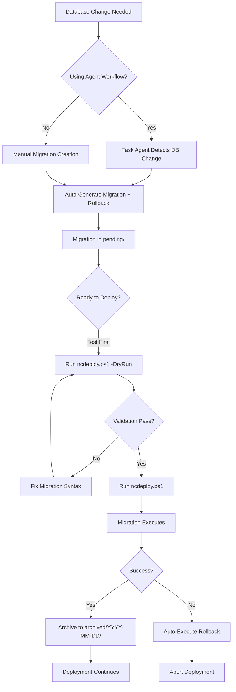

# Production Migration Workflow Guide

**Last Updated**: October 20, 2025  
**System**: deployment-migration  
**Status**: Production Ready ✅

---

## Table of Contents

1. [Overview](#overview)
2. [Quick Start](#quick-start)
3. [Migration Lifecycle](#migration-lifecycle)
4. [Creating Migrations](#creating-migrations)
5. [Testing Migrations](#testing-migrations)
6. [Deploying Migrations](#deploying-migrations)
7. [Rollback Procedures](#rollback-procedures)
8. [Troubleshooting](#troubleshooting)
9. [Best Practices](#best-practices)

---

## Overview

The production migration system automates database schema changes during deployment:

- ✅ **Automatic Generation**: Agents detect DB changes and create migrations
- ✅ **Safe Execution**: Transactions, idempotent checks, auto-rollback on failure
- ✅ **Audit Trail**: MigrationHistory table tracks all changes
- ✅ **Integrated Deployment**: ncdeploy.ps1 handles execution automatically
- ✅ **Dry-Run Validation**: Test without executing

### System Components

```
Scripts/Migrations/Prod/
├── pending/              # Migrations awaiting deployment
│   └── migration-{timestamp}-{key}-{description}.sql
├── archived/             # Successfully deployed migrations
│   └── {YYYY-MM-DD}/     # Organized by deployment date
└── rollback/             # Rollback scripts paired with migrations
    └── rollback-{timestamp}-{key}-{description}.sql
```

---

## Quick Start

### For Developers: Creating a Migration

When making database changes, the task agent will automatically generate migrations if you're using the agent workflow. For manual creation:

1. **Plan your database change**
2. **Let the agent generate the migration** (recommended)
   - Use `@workspace /task` with database changes
   - Agent detects DB changes and generates forward + rollback scripts
3. **OR manually create migration files** (see [Creating Migrations](#creating-migrations))

### For Deployment: Running Migrations

**Dry-run (validation only):**
```powershell
.\Scripts\ncdeploy.ps1 -DryRun
```

**Full deployment (with migrations):**
```powershell
.\Scripts\ncdeploy.ps1
```

---

## Migration Lifecycle



### Lifecycle Stages

1. **Creation**: Agent or developer creates migration + rollback scripts
2. **Pending**: Files placed in `Scripts/Migrations/Prod/pending/`
3. **Validation**: Dry-run checks syntax and safety patterns
4. **Execution**: ncdeploy.ps1 runs migrations during deployment
5. **Archival**: Successful migrations moved to `archived/{date}/`
6. **OR Rollback**: Failed migrations trigger auto-rollback + abort

---

## Creating Migrations

### Automatic Creation (Recommended)

Use the agent workflow for automatic migration generation:

```bash
# Start a task with database changes
@workspace /task key=my-feature "Add CanvasType column to Sessions table"
```

The task agent will:
1. Detect database changes in your request
2. Generate forward migration with timestamp
3. Generate rollback script
4. Include safety checks, transactions, idempotent logic
5. Commit migration files to git

### Manual Creation

If creating manually, follow this structure:

#### Forward Migration Template

**File**: `Scripts/Migrations/Prod/pending/migration-{YYYYMMDD-HHMMSS}-{key}-{description}.sql`

```sql
-- ============================================================================
-- Production Migration Script
-- ============================================================================
-- Migration ID: {YYYYMMDD-HHMMSS}
-- Key: {key}
-- Description: {description}
-- Created: {ISO-8601-timestamp}
-- Author: {your-name}
-- Database: KSESSIONS (Production)
-- Schema: canvas
-- ============================================================================

-- SAFETY CHECKS
IF DB_NAME() != 'KSESSIONS'
BEGIN
    RAISERROR('ERROR: This migration must run against KSESSIONS database only!', 16, 1)
    RETURN
END
GO

-- Check if already applied
IF EXISTS (SELECT 1 FROM canvas.MigrationHistory WHERE MigrationId = '{YYYYMMDD-HHMMSS}')
BEGIN
    PRINT 'Migration {YYYYMMDD-HHMMSS} already applied - skipping'
    RETURN
END
GO

-- MIGRATION LOGIC
BEGIN TRANSACTION MigrationTrans;

BEGIN TRY
    PRINT 'Starting migration: {description}'
    
    -- Example: Add column with idempotent check
    IF NOT EXISTS (SELECT 1 FROM sys.columns 
                   WHERE object_id = OBJECT_ID('canvas.Sessions') 
                   AND name = 'YourColumnName')
    BEGIN
        ALTER TABLE [canvas].[Sessions] 
        ADD [YourColumnName] NVARCHAR(50) NULL DEFAULT 'default-value';
        PRINT '  ✅ Added YourColumnName column'
    END
    
    -- Record in history
    INSERT INTO canvas.MigrationHistory (MigrationId, Description, AppliedAt, AppliedBy)
    VALUES ('{YYYYMMDD-HHMMSS}', '{description}', GETUTCDATE(), SYSTEM_USER);
    
    COMMIT TRANSACTION MigrationTrans;
    PRINT '✅ Migration {YYYYMMDD-HHMMSS} completed successfully'
    
END TRY
BEGIN CATCH
    ROLLBACK TRANSACTION MigrationTrans;
    DECLARE @ErrorMessage NVARCHAR(4000) = ERROR_MESSAGE();
    PRINT '❌ Migration failed: ' + @ErrorMessage
    RAISERROR(@ErrorMessage, 16, 1);
END CATCH
GO
```

#### Rollback Script Template

**File**: `Scripts/Migrations/Prod/rollback/rollback-{YYYYMMDD-HHMMSS}-{key}-{description}.sql`

```sql
-- ============================================================================
-- Production Migration Rollback Script
-- ============================================================================
-- Migration ID: {YYYYMMDD-HHMMSS}
-- Key: {key}
-- Description: Rollback {description}
-- Created: {ISO-8601-timestamp}
-- Author: {your-name}
-- Database: KSESSIONS (Production)
-- Schema: canvas
-- ============================================================================

-- SAFETY CHECKS
IF DB_NAME() != 'KSESSIONS'
BEGIN
    RAISERROR('ERROR: This rollback must run against KSESSIONS database only!', 16, 1)
    RETURN
END
GO

-- ROLLBACK LOGIC
BEGIN TRANSACTION RollbackTrans;

BEGIN TRY
    PRINT 'Starting rollback: {description}'
    
    -- Example: Remove column (reverse of forward migration)
    IF EXISTS (SELECT 1 FROM sys.columns 
               WHERE object_id = OBJECT_ID('canvas.Sessions') 
               AND name = 'YourColumnName')
    BEGIN
        ALTER TABLE [canvas].[Sessions] DROP COLUMN [YourColumnName];
        PRINT '  ✅ Dropped YourColumnName column'
    END
    
    -- Update history
    UPDATE canvas.MigrationHistory
    SET RolledBackAt = GETUTCDATE(), RolledBackBy = SYSTEM_USER
    WHERE MigrationId = '{YYYYMMDD-HHMMSS}';
    
    COMMIT TRANSACTION RollbackTrans;
    PRINT '✅ Rollback {YYYYMMDD-HHMMSS} completed successfully'
    
END TRY
BEGIN CATCH
    ROLLBACK TRANSACTION RollbackTrans;
    DECLARE @ErrorMessage NVARCHAR(4000) = ERROR_MESSAGE();
    PRINT '❌ Rollback failed: ' + @ErrorMessage
    RAISERROR(@ErrorMessage, 16, 1);
END CATCH
GO
```

### Required Safety Patterns

Every migration **MUST** include:

1. ✅ **DB_NAME() Check**: Prevent accidental execution against wrong database
2. ✅ **Transaction Wrapper**: BEGIN TRANSACTION...COMMIT (with CATCH rollback)
3. ✅ **Idempotent Checks**: IF NOT EXISTS (forward) / IF EXISTS (rollback)
4. ✅ **MigrationHistory Tracking**: INSERT on forward, UPDATE on rollback
5. ✅ **Error Handling**: BEGIN TRY...BEGIN CATCH with RAISERROR
6. ✅ **Already Applied Check**: Skip if migration already in MigrationHistory

**ncdeploy.ps1 validates these patterns in dry-run mode!**

---

## Testing Migrations

### Step 1: Dry-Run Validation

Always validate before deploying:

```powershell
.\Scripts\ncdeploy.ps1 -DryRun
```

**What it checks:**
- ✅ SQL syntax validity
- ✅ DB_NAME() safety check present
- ✅ Transaction wrapper present
- ✅ Error handling (BEGIN TRY...CATCH)
- ✅ MigrationHistory tracking
- ✅ Idempotent checks (IF EXISTS / IF NOT EXISTS)

**Example output:**
```
[STEP] Database Migrations: Checking for pending migrations...
→ Found 1 pending migration(s)
  - migration-20251020-134236-deployment-migration-test-column.sql

  ┌─ Executing: migration-20251020-134236-deployment-migration-test-column.sql
  │  [DRY-RUN] Validating SQL syntax...
  └─ [DRY-RUN] Syntax validation passed

========================================
  DRY-RUN MODE: Validation Complete
========================================
✅ Migration validation passed
→ No migrations were executed (dry-run mode)
```

### Step 2: Test Against KSESSIONS_DEV (Optional)

For extra safety, test against development database first:

```powershell
# Manually run against KSESSIONS_DEV
sqlcmd -S localhost -d KSESSIONS_DEV -i .\Scripts\Migrations\Prod\pending\migration-*.sql

# Verify changes
sqlcmd -S localhost -d KSESSIONS_DEV -Q "SELECT * FROM sys.columns WHERE object_id = OBJECT_ID('canvas.Sessions') AND name = 'YourColumnName'"

# Test rollback
sqlcmd -S localhost -d KSESSIONS_DEV -i .\Scripts\Migrations\Prod\rollback\rollback-*.sql

# Verify cleanup
sqlcmd -S localhost -d KSESSIONS_DEV -Q "SELECT * FROM sys.columns WHERE object_id = OBJECT_ID('canvas.Sessions') AND name = 'YourColumnName'"
```

---

## Deploying Migrations

### Standard Deployment Flow

1. **Ensure migrations are in `pending/` directory**
2. **Run dry-run validation** (optional but recommended)
3. **Execute deployment**

```powershell
# Step 1: Validate (optional)
.\Scripts\ncdeploy.ps1 -DryRun

# Step 2: Deploy
.\Scripts\ncdeploy.ps1
```

### What Happens During Deployment

**Step 0.5: Database Migrations** (runs before build):

1. **Detection**: Scans `Scripts/Migrations/Prod/pending/` for `migration-*.sql`
2. **Validation**: 
   - Checks sqlcmd availability
   - Validates KSESSIONS connectivity
   - Verifies MigrationHistory table exists (auto-creates if missing)
3. **Execution**:
   - Runs migrations in **alphabetical order** (timestamp-based)
   - Each migration executes against KSESSIONS database
   - Success message validated in output
4. **Archival**:
   - Successful migrations moved to `archived/{YYYY-MM-DD}/`
   - Preserves audit trail
5. **On Failure**:
   - Auto-executes corresponding `rollback-*.sql` script
   - Aborts deployment (no code deployed)
   - Database restored to previous state

### Deployment Output Example

```powershell
.\Scripts\ncdeploy.ps1

# Output:
========================================
  NoorCanvas Production Deployment
  Target: D:\Websites\NOOR-CANVAS
  Database: KSESSIONS (Production)
========================================

[STEP] Database Migrations: Checking for pending migrations...
→ Found 1 pending migration(s)
  - migration-20251020-134236-deployment-migration-test-column.sql
→ SQL Server command-line tools available
→ Validating connection to KSESSIONS (Production database)
✅ Connected to KSESSIONS database
✅ MigrationHistory table verified

  ┌─ Executing: migration-20251020-134236-deployment-migration-test-column.sql
  │  Running migration against KSESSIONS...
  └─ Migration completed successfully
     Archived to: archived/2025-10-20/migration-20251020-134236-deployment-migration-test-column.sql

✅ All migrations completed successfully

[STEP] Building application in Release mode from master branch...
...
```

---

## Rollback Procedures

### Automatic Rollback (Migration Failure)

If a migration fails during deployment, ncdeploy.ps1 **automatically**:

1. Detects the failure
2. Looks for `rollback-{same-timestamp}.sql`
3. Executes rollback script
4. **Aborts deployment** (no code deployed)
5. Displays rollback status

**Example:**
```
  ┌─ Executing: migration-20251020-143000-bad-migration.sql
  │  Running migration against KSESSIONS...
  └─ Migration FAILED: Column 'NonExistent' does not exist

  ⚠️  Rollback script found: rollback-20251020-143000-bad-migration.sql
  Executing rollback to restore database state...
  ✅ Rollback completed successfully
  Database restored to previous state

❌ Migration failed: migration-20251020-143000-bad-migration.sql
   Deployment aborted.
```

### Manual Rollback (Post-Deployment)

If you need to rollback a migration **after** deployment:

```powershell
# Find the archived migration
ls .\Scripts\Migrations\Prod\archived\2025-10-20\

# Execute corresponding rollback script
sqlcmd -S localhost -d KSESSIONS -i .\Scripts\Migrations\Prod\rollback\rollback-{timestamp}-{key}-{description}.sql

# Verify rollback in MigrationHistory
sqlcmd -S localhost -d KSESSIONS -Q "SELECT * FROM canvas.MigrationHistory WHERE MigrationId = '{timestamp}'"
```

---

## Troubleshooting

### Common Issues

#### Issue 1: "sqlcmd not found"

**Symptom:**
```
[ERROR] sqlcmd not found. Install SQL Server Command Line Utilities.
```

**Solution:**
1. Download SQL Server Command Line Utilities: https://aka.ms/ssmsfullsetup
2. Install SQLCMD (part of SQL Server tools)
3. Verify: `sqlcmd -?`

---

#### Issue 2: "Cannot connect to KSESSIONS database"

**Symptom:**
```
[ERROR] Failed to connect to KSESSIONS database
```

**Solution:**
1. Verify SQL Server is running: `Get-Service MSSQLSERVER`
2. Check database exists: `sqlcmd -S localhost -Q "SELECT name FROM sys.databases WHERE name = 'KSESSIONS'"`
3. Verify connection string: `sqlcmd -S localhost -d KSESSIONS -Q "SELECT DB_NAME()"`

---

#### Issue 3: "Migration already applied - skipping"

**Symptom:**
```
Migration 20251020-134236 already applied - skipping
```

**Explanation:**
- This is **normal behavior** (idempotency)
- Migration detected existing entry in MigrationHistory
- Skipped to prevent duplicate execution

**Action:**
- No action needed if expected
- If re-running after rollback, check MigrationHistory: `SELECT * FROM canvas.MigrationHistory WHERE MigrationId = '20251020-134236'`

---

#### Issue 4: "Rollback FAILED"

**Symptom:**
```
❌ Rollback FAILED
⚠️  CRITICAL: Database may be in inconsistent state!
```

**Solution:**
1. **DO NOT deploy code** until database is fixed
2. Check MigrationHistory: `SELECT * FROM canvas.MigrationHistory WHERE MigrationId = '{timestamp}'`
3. Manually inspect database schema changes
4. Manually reverse changes if needed
5. Contact DBA if uncertain

---

#### Issue 5: Dry-Run Shows Validation Warnings

**Symptom:**
```
[DRY-RUN] Validation warnings:
  ⚠️  Missing idempotent checks (IF EXISTS / IF NOT EXISTS)
```

**Solution:**
1. Review migration script
2. Add missing safety patterns (see [Required Safety Patterns](#required-safety-patterns))
3. Re-run dry-run validation
4. Fix all warnings before deploying

---

### Debugging Tips

**View MigrationHistory:**
```sql
SELECT * FROM canvas.MigrationHistory 
ORDER BY AppliedAt DESC;
```

**Check if migration was rolled back:**
```sql
SELECT * FROM canvas.MigrationHistory 
WHERE MigrationId = '{timestamp}' AND RolledBackAt IS NOT NULL;
```

**Find pending migrations:**
```powershell
ls .\Scripts\Migrations\Prod\pending\migration-*.sql
```

**Find archived migrations:**
```powershell
ls .\Scripts\Migrations\Prod\archived\*\migration-*.sql
```

---

## Best Practices

### 1. Always Use Agent Workflow

Let the task agent generate migrations automatically:
- ✅ Correct syntax guaranteed
- ✅ Safety checks included
- ✅ Rollback scripts auto-generated
- ✅ Proper naming convention
- ✅ Git integration automatic

### 2. Test Before Deploying

```powershell
# ALWAYS run dry-run first
.\Scripts\ncdeploy.ps1 -DryRun

# Then deploy
.\Scripts\ncdeploy.ps1
```

### 3. One Change Per Migration

**Good:**
```sql
-- migration-20251020-140000-add-canvastype-column.sql
ALTER TABLE canvas.Sessions ADD CanvasType NVARCHAR(20);
```

**Bad:**
```sql
-- migration-20251020-140000-multiple-changes.sql
ALTER TABLE canvas.Sessions ADD CanvasType NVARCHAR(20);
ALTER TABLE canvas.Sessions ADD AnotherColumn INT;
CREATE INDEX IX_NewIndex ON canvas.Sessions(CanvasType);
-- Hard to rollback, hard to debug failures
```

### 4. Make Migrations Idempotent

**Always** use IF NOT EXISTS (forward) and IF EXISTS (rollback):

```sql
-- Forward migration
IF NOT EXISTS (SELECT 1 FROM sys.columns WHERE object_id = OBJECT_ID('canvas.Sessions') AND name = 'CanvasType')
BEGIN
    ALTER TABLE [canvas].[Sessions] ADD [CanvasType] NVARCHAR(20);
END

-- Rollback
IF EXISTS (SELECT 1 FROM sys.columns WHERE object_id = OBJECT_ID('canvas.Sessions') AND name = 'CanvasType')
BEGIN
    ALTER TABLE [canvas].[Sessions] DROP COLUMN [CanvasType];
END
```

### 5. Use Descriptive Names

**Good naming:**
```
migration-20251020-140000-user-landing-add-canvastype-column.sql
migration-20251020-150000-session-tracking-add-performance-indexes.sql
```

**Bad naming:**
```
migration-1.sql
new-migration.sql
fix.sql
```

### 6. Never Edit Archived Migrations

Once a migration is in `archived/`, it's deployed to production.

- ❌ Never modify archived migrations
- ❌ Never delete archived migrations
- ✅ Create a new migration to make additional changes

### 7. Keep Rollbacks Simple

Rollback scripts should **exactly reverse** the forward migration:

```sql
-- Forward: Add column
ALTER TABLE canvas.Sessions ADD CanvasType NVARCHAR(20);

-- Rollback: Remove column (exact reverse)
ALTER TABLE canvas.Sessions DROP COLUMN CanvasType;
```

### 8. Document Complex Migrations

Add comments for non-obvious changes:

```sql
-- This migration adds CanvasType column to track whether the session
-- is using Asset Share or Section Share mode. This enables proper
-- routing on UserLanding.razor based on host's selection.
ALTER TABLE [canvas].[Sessions] ADD [CanvasType] NVARCHAR(20) NULL DEFAULT 'asset';
```

---

## Additional Resources

- **Migration README**: `Scripts/Migrations/Prod/README.md`
- **Agent Prompts**:
  - Plan Agent: `.github/prompts/plan.prompt.md` (Database Migration Protocol)
  - Task Agent: `.github/prompts/task.prompt.md` (Step 5d: Migration Generation)
  - Test Agent: `.github/prompts/test-generation.prompt.md` (Migration Validation Tests)
- **Deployment Plan**: `.github/prompts.keys/deployment-migration/deployment-migration.plan.md`
- **Work Log**: `.github/prompts.keys/deployment-migration/work-log.md`

---

## Summary

✅ **Automatic**: Agents generate migrations for DB changes  
✅ **Safe**: Transactions, rollbacks, idempotent checks  
✅ **Auditable**: MigrationHistory tracks all changes  
✅ **Integrated**: ncdeploy.ps1 handles execution  
✅ **Testable**: Dry-run validates before deployment  
✅ **Recoverable**: Auto-rollback on failure

**Questions?** See troubleshooting section or contact the development team.
